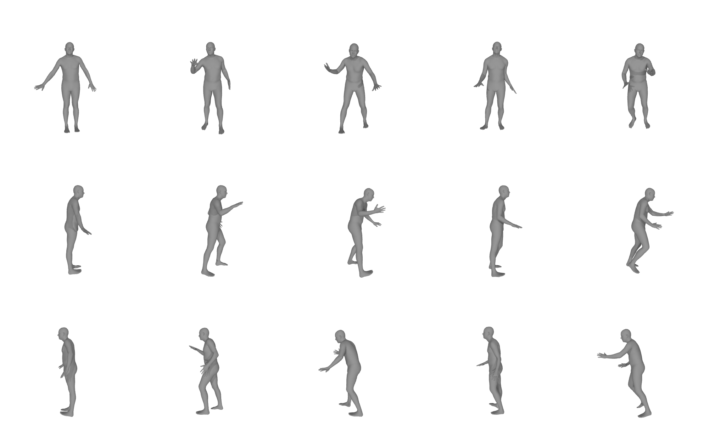

# Sampling novel poses from VPoser
You can use VPoser to produce novel random poses. 
This generative model can be potentially used as a synthetic data generator to train other data dependent models.
For this you would need to first obtain a trained VPoser model from https://smpl-x.is.tue.mpg.de/downloads .
Afterwards you can use the following code snippet to sample new poses: 
```python
from human_body_prior.tools.model_loader import load_vposer

expr_dir = 'TRAINED_MODEL_DIRECTORY' # in this directory the trained model along with the model code exist
num_sample_batch = 10 # number of body poses in each batch
 
vposer_pt, ps = load_vposer(expr_dir, vp_model='snapshot')
sampled_pose_body = vposer_pt.sample_poses(num_poses=num_sample_batch) # will a generate Nx1x21x3 tensor of body poses  
```

To visualize the generated poses you can use the *sample_body_pose* script. 
The visualization code requires you to give the path to a SMPL model, obtainable from https://smpl-x.is.tue.mpg.de/downloads
The following shows an example:
```python
from human_body_prior.body_model.body_model import BodyModel
from human_body_prior.tutorials.sample_body_pose import sample_vposer

bm_path = 'PATH_TO_SMPL_model.npz' # obtain from https://smpl-x.is.tue.mpg.de/downloads
bm = BodyModel(bm_path, 'smpl')

expr_dir = 'TRAINED_MODEL_DIRECTORY' # directory for the trained model along with the model code. obtain from https://smpl-x.is.tue.mpg.de/downloads
sample_vposer(expr_dir, bm, 5, vp_model='snapshot')
```



The each column of the first row of the above image are the novel poses, and the following rows are varied rotations for demonstration purpose
so that you can see the generated body from different angles.
